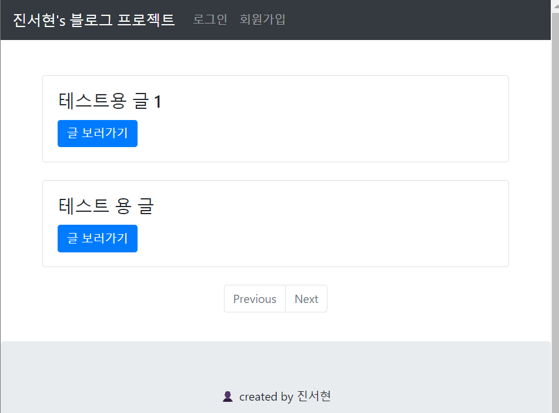
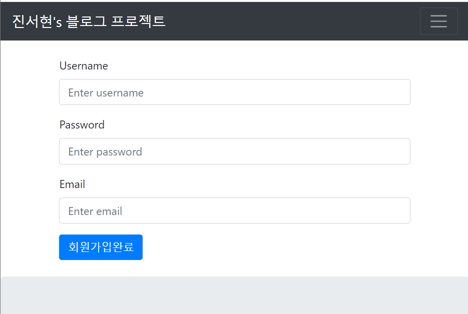
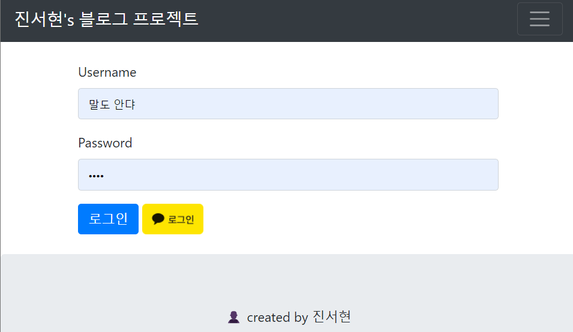
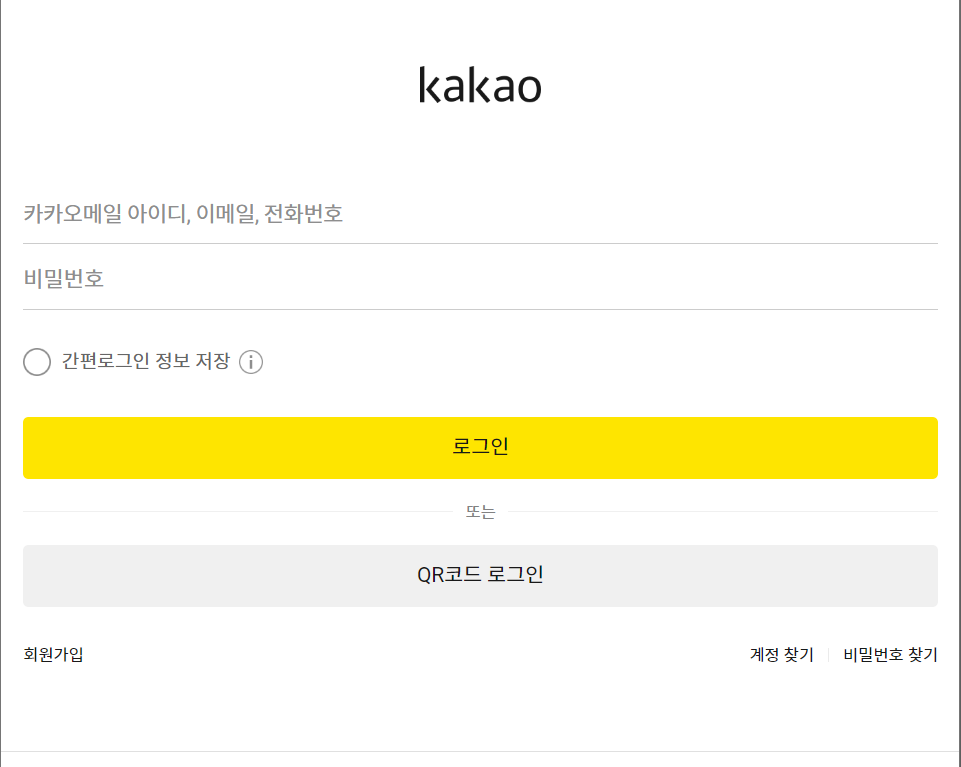
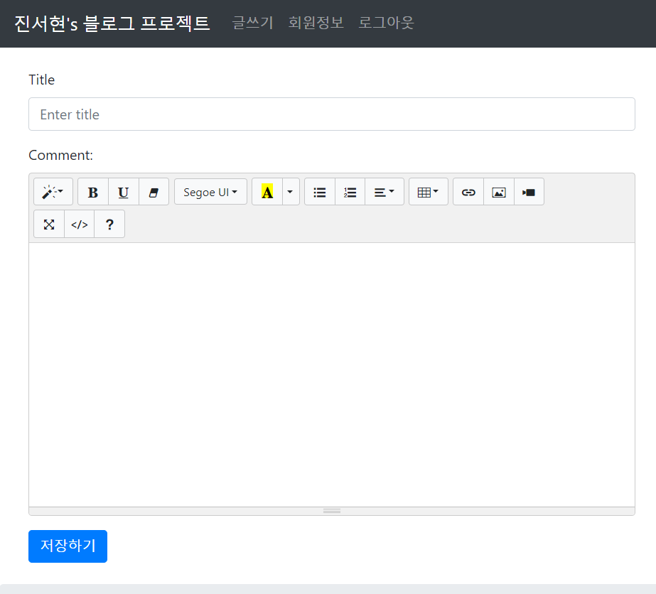
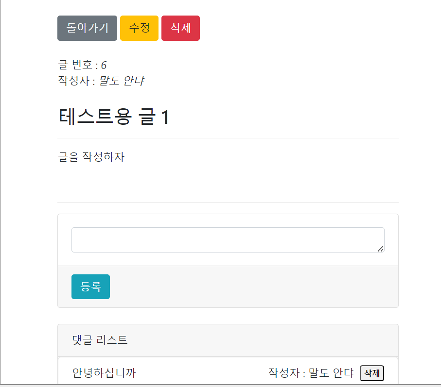
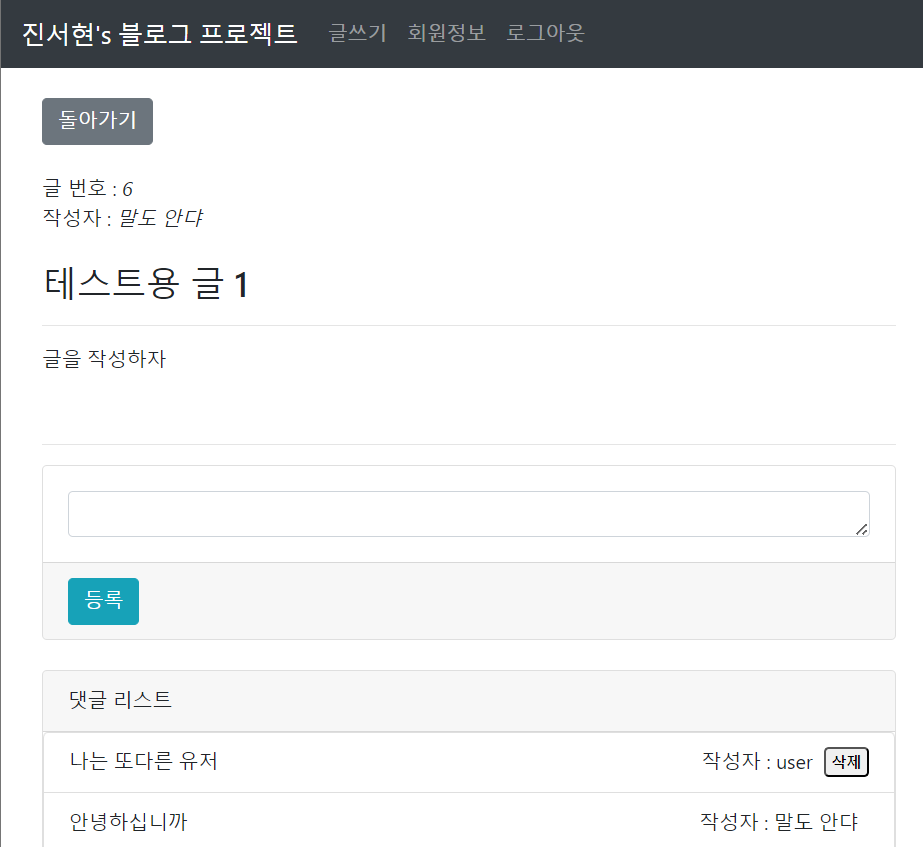

# 스프링 부트와 JSP를 활용한 블로그 프로젝트
***
#### 📆 기간 : 2024년 1월~2월 진행
***
### 🖊️ 설명
기본적인 등록,수정,삭제에 대한 기능을 구현하고 스프링 시큐리티와 카카오 OAuth를 적용한 블로그 프로젝트
***
### 🖥️ 구현 화면
#### 메인화면

#### 회원가입

#### 로그인

#### 카카오 로그인

#### 로그인 시 이용 가능한 글 쓰기

#### 댓글 보기와 작성자에 다른 댓글, 글 삭제 권한

***

## 구현을 하면서 얻을 수 있었던 점

🚩 회원가입, 로그인, 글 관련 기본 기능, 댓글 관련 기본 기능을 구현한 블로그 프로젝트를 통하여 스프링의 기본 원리를 이해하고 활용하였다.

🚩 스프링 시큐리티를 적용하여 인증과 인가, 보안 설정과 사용자 세션을 이해하고 관리하였다.

🚩 외부 API인 카카오 OAuth를 사용하여, API를 통한 통신과 OAuth의 기본 개념을 이해했다.
***

### [자세한 내용 보러가기](https://opalescent-leaf-e7c.notion.site/ff0ff663f4b3403fb0e88088b68fa768?pvs=4)